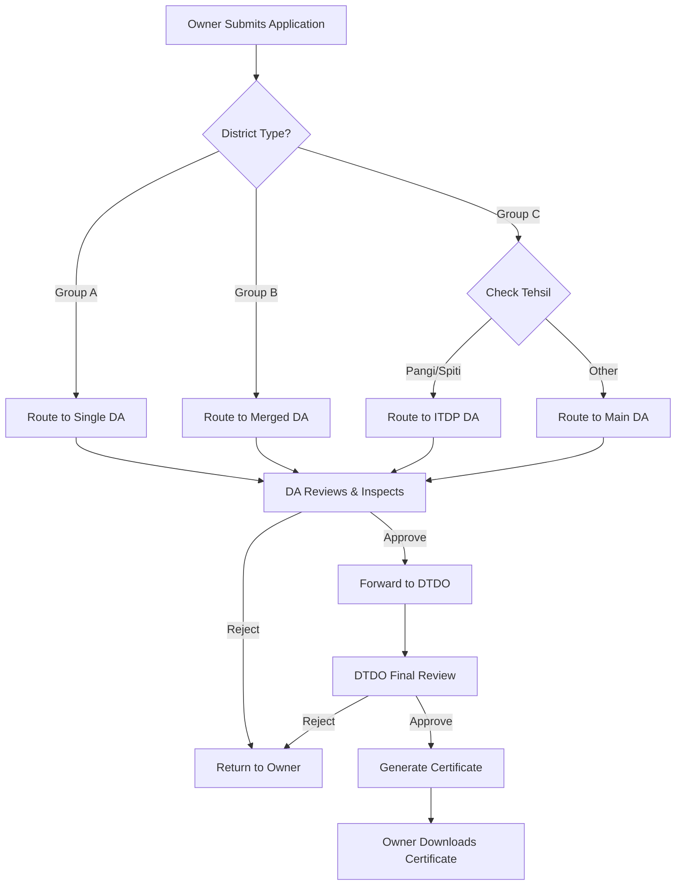

# HP Homestay Registration - Workflow & Pipeline Architecture

## Overview

The HP Homestay Registration Portal manages application processing across **12 administrative districts** of Himachal Pradesh. Due to varying geographic, administrative, and operational requirements, these districts are organized into **12 distinct processing pipelines** under three groups.

---

## Pipeline Summary

| Group | Description | Districts | Pipelines |
|-------|-------------|-----------|-----------|
| **A** | Single District → Single Pipeline | 6 | 6 |
| **B** | Two Districts → One Pipeline (Merged) | 4 | 2 |
| **C** | One District → Two Pipelines (Split by Tehsil) | 2 | 4 |
| **Total** | | **12 districts** | **12 pipelines** |

---

## Group A: Single District - Single Pipeline (6 Pipelines)

These districts have a straightforward 1:1 mapping between district and processing authority.

```
┌─────────────────────────────────────────────────────────────────┐
│  DISTRICT    │  DA (Dealing Assistant)  │  DTDO (District TDO) │
├─────────────────────────────────────────────────────────────────┤
│  Kangra      │  da_dharamsala           │  dtdo_dharamsala     │
│  Kinnaur     │  da_kinnaur              │  dtdo_kinnaur        │
│  Kullu       │  da_kullu_manali         │  dtdo_kullu_manali   │
│  Shimla      │  da_shimla               │  dtdo_shimla         │
│  Sirmaur     │  da_sirmaur              │  dtdo_sirmaur        │
│  Solan       │  da_solan                │  dtdo_solan          │
└─────────────────────────────────────────────────────────────────┘
```

### Workflow:
```
Owner (District X) → DA (District X) → DTDO (District X) → Certificate
```

---

## Group B: Two Districts - One Pipeline (2 Pipelines)

These districts are **merged** for administrative efficiency. One DTDO/DA team handles applications from two districts.

### Pipeline 7: Hamirpur + Una

```
┌────────────────────────────────────────────────────────────────────────┐
│  RECEIVING PIPELINE: Hamirpur                                          │
├────────────────────────────────────────────────────────────────────────┤
│  Source Districts: Hamirpur, Una                                       │
│  DA:   da_hamirpur                                                     │
│  DTDO: dtdo_hamirpur                                                   │
├────────────────────────────────────────────────────────────────────────┤
│  DORMANT ACCOUNTS (Inactive):                                          │
│  - da_una (reserved for future use)                                    │
│  - dtdo_una (reserved for future use)                                  │
└────────────────────────────────────────────────────────────────────────┘
```

### Pipeline 8: Bilaspur + Mandi

```
┌────────────────────────────────────────────────────────────────────────┐
│  RECEIVING PIPELINE: Bilaspur                                          │
├────────────────────────────────────────────────────────────────────────┤
│  Source Districts: Bilaspur, Mandi                                     │
│  DA:   da_bilaspur                                                     │
│  DTDO: dtdo_bilaspur                                                   │
├────────────────────────────────────────────────────────────────────────┤
│  DORMANT ACCOUNTS (Inactive):                                          │
│  - da_mandi (reserved for future use)                                  │
│  - dtdo_mandi (reserved for future use)                                │
└────────────────────────────────────────────────────────────────────────┘
```

### Workflow:
```
Owner (Una)     ─┐
                 ├→ DA (Hamirpur) → DTDO (Hamirpur) → Certificate
Owner (Hamirpur)─┘

Owner (Mandi)    ─┐
                  ├→ DA (Bilaspur) → DTDO (Bilaspur) → Certificate
Owner (Bilaspur) ─┘
```

### Technical Routing:
Applications from Una and Mandi are automatically routed to their parent pipelines:
- `Una` → routes to `Hamirpur` pipeline
- `Mandi` → routes to `Bilaspur` pipeline

---

## Group C: One District - Two Pipelines (4 Pipelines)

These districts are **split** due to geography, accessibility, and special administrative requirements (ITDP areas).

### Chamba District (2 Pipelines)

```
┌──────────────────────────────────────────────────────────────────────────┐
│  CHAMBA DISTRICT SPLITS                                                  │
├──────────────────────────────────────────────────────────────────────────┤
│  PIPELINE 9: Chamba HQ                                                   │
│  Tehsils: All tehsils EXCEPT Pangi                                       │
│  DA:   da_chamba                                                         │
│  DTDO: dtdo_chamba                                                       │
├──────────────────────────────────────────────────────────────────────────┤
│  PIPELINE 10: Pangi (ITDP Area)                                          │
│  Tehsils: Pangi only                                                     │
│  DA:   da_pangi                                                          │
│  DTDO: (TBD - May use Chamba DTDO on Additional Charge)                  │
│  Special: 50% Registration Fee Waiver                                    │
└──────────────────────────────────────────────────────────────────────────┘
```

> **Note:** Bharmour Sub-Division was previously a separate pipeline but is now merged with Chamba HQ. The `da_bharmour` and `dtdo_bharmour` accounts remain dormant unless reactivated.

### Lahaul-Spiti District (2 Pipelines)

```
┌──────────────────────────────────────────────────────────────────────────┐
│  LAHAUL-SPITI DISTRICT SPLITS                                            │
├──────────────────────────────────────────────────────────────────────────┤
│  PIPELINE 11: Lahaul (Keylong)                                           │
│  Tehsils: Lahaul, Udaipur                                                │
│  DA:   da_lahaul                                                         │
│  DTDO: dtdo_lahaul                                                       │
├──────────────────────────────────────────────────────────────────────────┤
│  PIPELINE 12: Kaza (Spiti ITDP)                                          │
│  Tehsils: Spiti (Kaza)                                                   │
│  DA:   da_kaza                                                           │
│  DTDO: (TBD - May use Lahaul DTDO on Additional Charge)                  │
│  Special: ITDP benefits may apply                                        │
└──────────────────────────────────────────────────────────────────────────┘
```

### Workflow:
```
Owner (Chamba, non-Pangi tehsil) → DA (Chamba) → DTDO (Chamba) → Certificate
Owner (Pangi tehsil)             → DA (Pangi)  → DTDO (Pangi?) → Certificate

Owner (Lahaul/Udaipur tehsil)    → DA (Lahaul) → DTDO (Lahaul) → Certificate
Owner (Spiti tehsil)             → DA (Kaza)   → DTDO (Kaza?)  → Certificate
```

### Technical Routing:
Tehsil-based routing is implemented in `districtRouting.ts`:
- Chamba District + Pangi Tehsil → `Pangi` pipeline
- Chamba District + Other Tehsils → `Chamba` pipeline
- Lahaul-Spiti + Spiti/Kaza Tehsil → `Kaza` pipeline
- Lahaul-Spiti + Lahaul/Udaipur Tehsil → `Lahaul` pipeline

---

## Complete Pipeline Map

```
┌────────────────────────────────────────────────────────────────────────────┐
│                        HP HOMESTAY REGISTRATION                            │
│                     12 PROCESSING PIPELINES                                │
├────────────────────────────────────────────────────────────────────────────┤
│                                                                            │
│  GROUP A (6 Independent Pipelines)                                         │
│  ┌──────────┐ ┌──────────┐ ┌──────────┐ ┌──────────┐ ┌──────────┐ ┌──────┐ │
│  │ KANGRA   │ │ KINNAUR  │ │  KULLU   │ │  SHIMLA  │ │ SIRMAUR  │ │SOLAN │ │
│  │   (1)    │ │   (2)    │ │   (3)    │ │   (4)    │ │   (5)    │ │ (6)  │ │
│  └──────────┘ └──────────┘ └──────────┘ └──────────┘ └──────────┘ └──────┘ │
│                                                                            │
│  GROUP B (2 Merged Pipelines - covering 4 districts)                       │
│  ┌─────────────────────────┐     ┌─────────────────────────┐               │
│  │  HAMIRPUR (7)           │     │  BILASPUR (8)           │               │
│  │  ← Hamirpur + Una       │     │  ← Bilaspur + Mandi     │               │
│  └─────────────────────────┘     └─────────────────────────┘               │
│                                                                            │
│  GROUP C (4 Split Pipelines - from 2 districts)                            │
│  ┌───────────────────────────────────────────────────────────────────────┐ │
│  │  CHAMBA DISTRICT                    │  LAHAUL-SPITI DISTRICT          │ │
│  │  ┌────────────┐  ┌────────────┐     │  ┌────────────┐  ┌────────────┐ │ │
│  │  │ CHAMBA (9) │  │ PANGI (10) │     │  │ LAHAUL (11)│  │ KAZA (12)  │ │ │
│  │  │ All tehsils│  │ Pangi only │     │  │ Lahaul,    │  │ Spiti only │ │ │
│  │  │ except     │  │ (ITDP)     │     │  │ Udaipur    │  │ (ITDP)     │ │ │
│  │  │ Pangi      │  │            │     │  │            │  │            │ │ │
│  │  └────────────┘  └────────────┘     │  └────────────┘  └────────────┘ │ │
│  └───────────────────────────────────────────────────────────────────────┘ │
│                                                                            │
└────────────────────────────────────────────────────────────────────────────┘
```

---

## Application Flow (Standard Pipeline)



---

## Special Rules

### Fee Waivers

| Location | Waiver |
|----------|--------|
| Pangi Sub-Division | 50% Registration Fee Waiver |
| Spiti (Kaza) | ITDP Benefits (TBD) |

### Dormant Accounts

The following accounts are created but marked inactive:
- `da_una`, `dtdo_una` - May be activated if Una gets independent pipeline
- `da_mandi`, `dtdo_mandi` - May be activated if Mandi gets independent pipeline
- `da_bharmour`, `dtdo_bharmour` - May be reactivated if Bharmour needs separate pipeline

---

## Technical Implementation

### Key Files:

| File | Purpose |
|------|---------|
| `shared/districtRouting.ts` | Maps owner's district/tehsil to processing pipeline |
| `shared/districtStaffManifest.ts` | Contains DA/DTDO credentials and district assignments |
| `server/routes/helpers/district.ts` | Server-side district routing helpers |

### Routing Logic (districtRouting.ts):

```typescript
// Group B: Merge routing
case "una": return "Hamirpur";       // Una → Hamirpur pipeline
case "mandi": return "Bilaspur";     // Mandi → Bilaspur pipeline

// Group C: Split routing (by tehsil)
case "chamba":
  if (tehsil === "pangi") return "Pangi";
  return "Chamba";

case "lahaul and spiti":
  if (tehsil === "kaza" || tehsil === "spiti") return "Kaza";
  return "Lahaul";
```

---

## Open Questions

1. **Pangi DTDO:** Does Pangi need its own DTDO, or will Chamba DTDO hold Additional Charge?
2. **Kaza DTDO:** Does Kaza need its own DTDO, or will Lahaul DTDO hold Additional Charge?
3. **Una/Mandi Activation:** Under what conditions would these dormant pipelines be activated?
4. **Bharmour Status:** Should Bharmour remain merged with Chamba HQ permanently?

---

## Version History

| Version | Date | Changes |
|---------|------|---------|
| 1.0 | 2026-01-15 | Initial documentation of 12-pipeline architecture |
